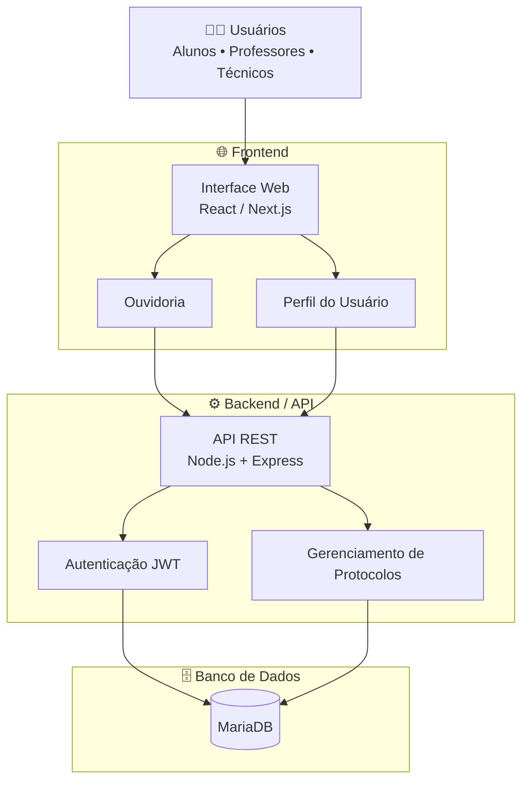

# Alô UESPI

Plataforma digital de ouvidoria universitária desenvolvida para modernizar o atendimento da comunidade acadêmica da UESPI.

---

## 📌 Sobre o Projeto

O Alô UESPI é um sistema de ouvidoria digital criado para facilitar o envio, acompanhamento e gerenciamento de manifestações acadêmicas, como:

- Reclamações
- Sugestões
- Denúncias
- Solicitações
- Elogios

A plataforma busca aumentar a transparência, acessibilidade e eficiência na comunicação entre estudantes e universidade.

---

## 🚀 Funcionalidades

- Cadastro de manifestações
- Envio anônimo
- Sistema de prioridades
- Painel administrativo
- Acompanhamento por protocolo
- Interface responsiva

---

## 🛠️ Tecnologias Utilizadas

- React
- TypeScript
- Tailwind CSS
- Vite
- Express

---

Antes de iniciar tenha instalado: node.js, npm, docker e git

### Clone o repositório

```bash
git clone https://github.com/Danielcruzss/alo_uespi.git

---

## ⚙️ Como Executar o Projeto

Iniciar o banco de dados
```bash
sudo docker start alo-mariadb

Sincronizar prisma com o banco
```bash
npx prisma db push
npx prisma generate

Instalar dependências e tipagens
```bash
cd backend
npm install
cd frontend
npm install

Iniciar backend e frontend
```bash
cd backend
npm run dev
cd frontend
npm run dev -- --host


## 🏗️ Arquitetura da Solução


