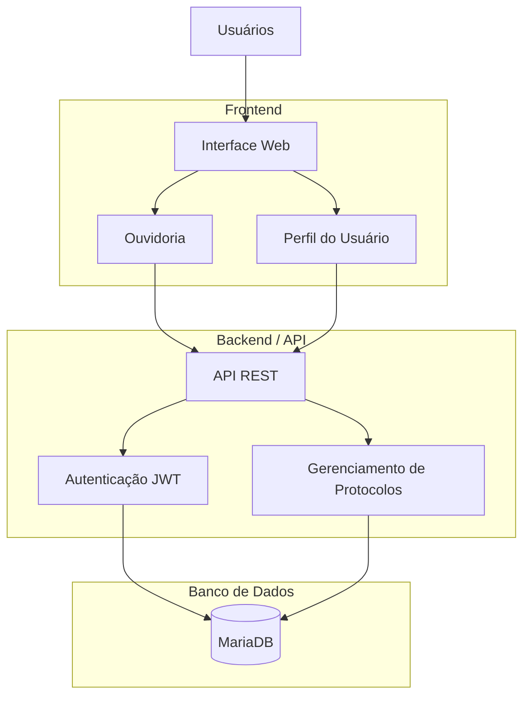

# Alô UESPI

Plataforma digital de ouvidoria universitária desenvolvida para modernizar o atendimento da comunidade acadêmica da UESPI.

---

## 📌 Sobre o Projeto

O Alô UESPI é um sistema de ouvidoria digital criado para facilitar o envio, acompanhamento e gerenciamento de manifestações acadêmicas, como:

- Reclamações
- Sugestões
- Denúncias
- Solicitações
- Elogios

A plataforma busca aumentar a transparência, acessibilidade e eficiência na comunicação entre estudantes e universidade.

---

## 🚀 Funcionalidades

- Cadastro de manifestações
- Envio anônimo
- Sistema de prioridades
- Painel administrativo
- Acompanhamento por protocolo
- Interface responsiva

---

## 🛠️ Tecnologias Utilizadas

- React
- TypeScript
- CSS
- Vite
- Express
- MariaDB
- Prisma ORM

---

## 📋 Pré-requisitos

Antes de iniciar, tenha instalado:

- Node.js
- npm
- Docker
- Git

---

## 📥 Clone o Repositório

```bash
git clone https://github.com/Danielcruzss/alo_uespi.git
```

---

## ⚙️ Como Executar o Projeto

### 1. Iniciar o banco de dados

```bash
sudo docker start alo-mariadb
```

### 2. Sincronizar Prisma com o banco

```bash
npx prisma db push
npx prisma generate
```

### 3. Instalar dependências

```bash
cd backend
npm install

cd ../frontend
npm install
```

### 4. Iniciar backend e frontend

#### Backend

```bash
cd backend
npm run dev
```

#### Frontend

```bash
cd frontend
npm run dev -- --host
```

---

## 🏗️ Arquitetura da Solução



---

## 👥 Equipe

Projeto desenvolvido por Daniel, Guilherme, Mateus e Raul para o Hackathon do Piauí para o mundo.